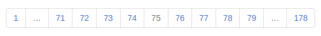

PHP Pagination
=============

Simple PHP script which adds custom pagination to your website.

## Installation

Install with composer: 

    composer require ashtaev/pagination

## Screenshot

 
    
## Quick example
    
    <?php
    
    require '../vendor/autoload.php';
    
    use ashtaev\Pagination;
    
    $total= 1777;                  // The total number of items
    $page = 75;                    // The current page number
    $path = '/articles/[:page]';   // A URL for each page
    
    $pagination = new Pagination();
    
    $pages = $pagination->get($total, $page, $path);
    
    ?>
    <html>
      <head>
        <link rel="stylesheet" href="//maxcdn.bootstrapcdn.com/bootstrap/3.2.0/css/bootstrap.min.css">
      </head>
      <body>
      
        <nav aria-label="Page navigation example">
          <ul class="pagination my-4">
            <?php foreach ($pages as $page): ?>
              <?php if($page['url']): ?>
                <li class="page-item"><a class="page-link" href="<?= $page['url'] ?>"><?= $page['num'] ?></a></li>
              <?php else: ?>
                <li class="page-item disabled"><a class="page-link" href="#"><?= $page['num'] ?></a></li>
              <?php endif ?>
            <?php endforeach; ?>
          </ul>
        </nav>
        
      </body>
    </html>
    
Output:

    <nav aria-label="Page navigation example">
      <ul class="pagination my-4">
        <li class="page-item"><a class="page-link" href="/articles/1">1</a></li>
        <li class="page-item disabled"><a class="page-link" href="#">…</a></li>
        <li class="page-item"><a class="page-link" href="/articles/71">71</a></li>
        <li class="page-item"><a class="page-link" href="/articles/72">72</a></li>
        <li class="page-item"><a class="page-link" href="/articles/73">73</a></li>
        <li class="page-item"><a class="page-link" href="/articles/74">74</a></li>
        <li class="page-item disabled"><a class="page-link" href="#">75</a></li>
        <li class="page-item"><a class="page-link" href="/articles/76">76</a></li>
        <li class="page-item"><a class="page-link" href="/articles/77">77</a></li>
        <li class="page-item"><a class="page-link" href="/articles/78">78</a></li>
        <li class="page-item"><a class="page-link" href="/articles/79">79</a></li>
        <li class="page-item disabled"><a class="page-link" href="#">…</a></li>
        <li class="page-item"><a class="page-link" href="/articles/178">178</a></li>
      </ul>
    </nav>